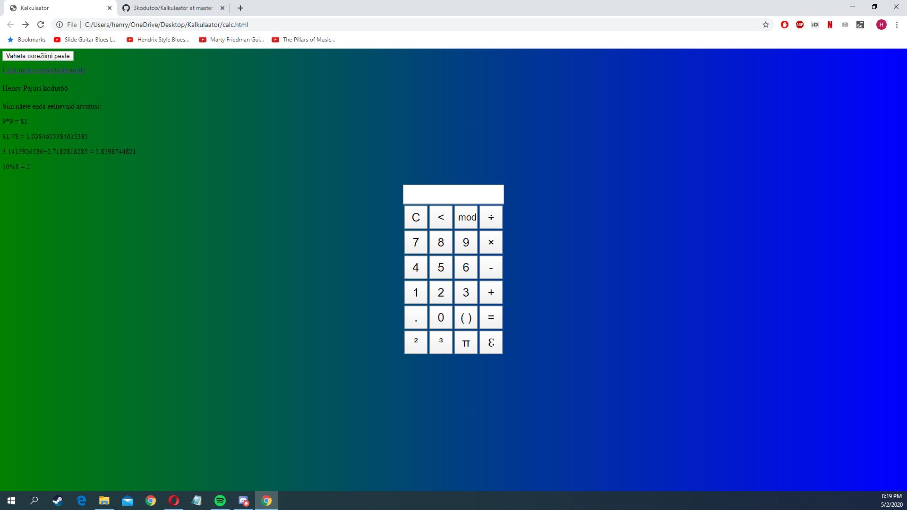

# 3kodutoo Henry Pajuri

3. kodutöö Eesrakenduste arendamises. Tegemist on küllatki lihtsa ning kergesti arusaadava rakendusega.

Kodutöö tegemiseks kasutasin õpetust: https://www.youtube.com/watch?v=JDiurjhpOXA

Ise lisatud funtsionaalsused:

- Võimalus vahetada öörežiimi ja päevarežiimi vahel. (Muutub ka vastavalt teksti värv)
- Vasakul võimalik näha eelmisi arvutusi sama sessiooni jooksul.
- mod nupuga on võimalik jagada jäägiga.
- Sulgude lisamise funktsioon. Esimene kord lisab "(", teine kord ")" 
- Saab arvu ruutu ja kuupi võtta.
- Euleri numbri ja pi lisamise funktsioonid.
