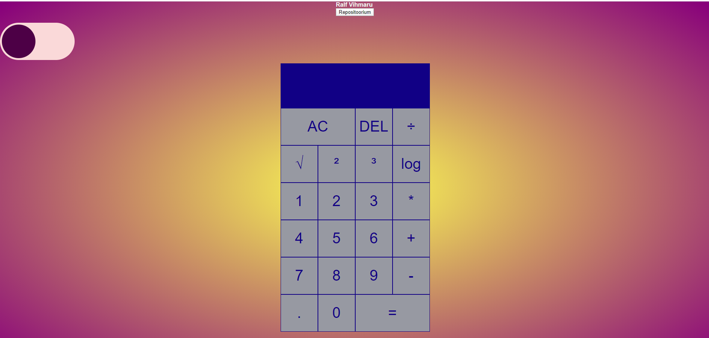

# Ralf Vihmaru kalkulaatori kodutöö
## Funktsionaalsused

- Veebirakendus töötab.
- Kalkulaatoril on öö- ja päevarežiim, mida saab nupust kasutada.
- Juurde on lisatud ruudus, kuubis, ruutjuurega ja logaritmiga arvutamis võimalused.
- Lehel on võimalik näha autori nime ja on ka link repositooriumile.

Kasutasin kalkulaatori tegemiseks videot https://www.youtube.com/watch?v=j59qQ7YWLxw&t

