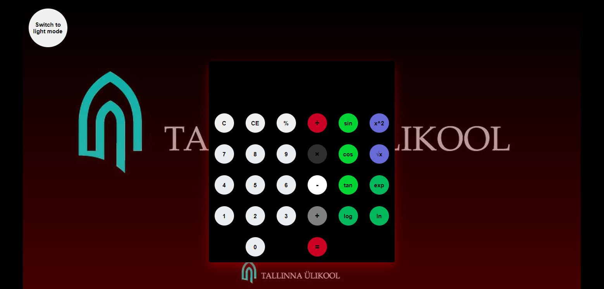

Autor: Mihkel Vaher

Kasutatud tutorial: https://www.youtube.com/watch?v=CI2GwL--ll8

Salvestab eelmised arvutused, öö- ja päevavaade, lisatud täiendavad funktsionaalsused.

Lisatud kalkuleerimisfunktsionaalsused:
* Sin
* Cos
* Tan,

* Logaritm
* Ln
* Eksponentsiaal,

* Ruut
* Ruutjuur
