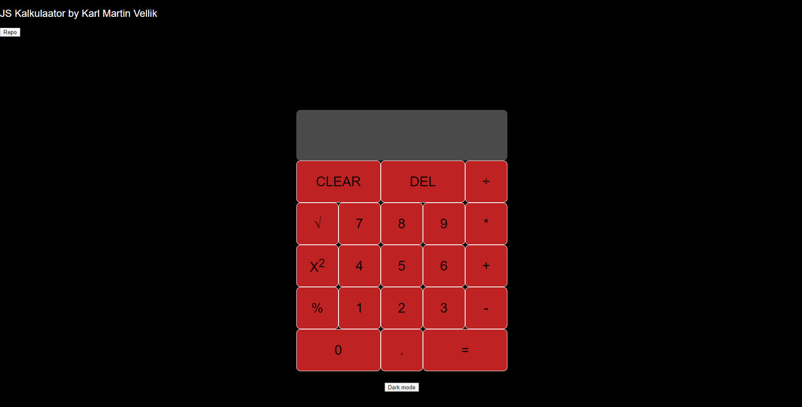

# Kodutöö 3
## Karl Martin Vellik
http://www.tlu.ee/~wellik/Eesrakendused/Kodutoo%203/calculator.html

Kasutatud video: https://www.youtube.com/watch?v=j59qQ7YWLxw

## Funktsionaalsus
* ÖÖ ja päeva režiim
* Kõik tavalised kalkulaatori funktsioonid
* Lisatud ruutjuur, ruutu võtmine ning protsent funktsioon
* Leheküljel on autori nimi ning viide repole

