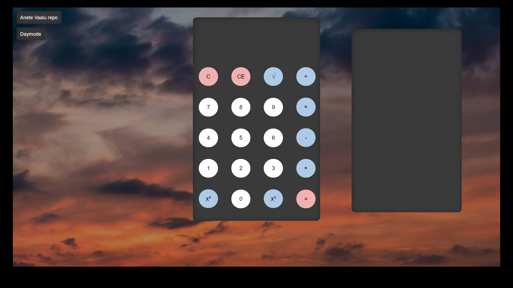

## 3. kodutöö kalkulaator
Anete Vaalu  
Funktsionaalsus: liitmine, lahutamine, korrutamine, jagamine, arvust ruudu, kuubi ja ruutjuure võtmine, kogu tehte kustutamine, number haaval kustutamine, öö- ja päevarežiim, näeb arvutuste ajalugu  
kasutatud õpetus: https://www.youtube.com/watch?v=CI2GwL--ll8  

