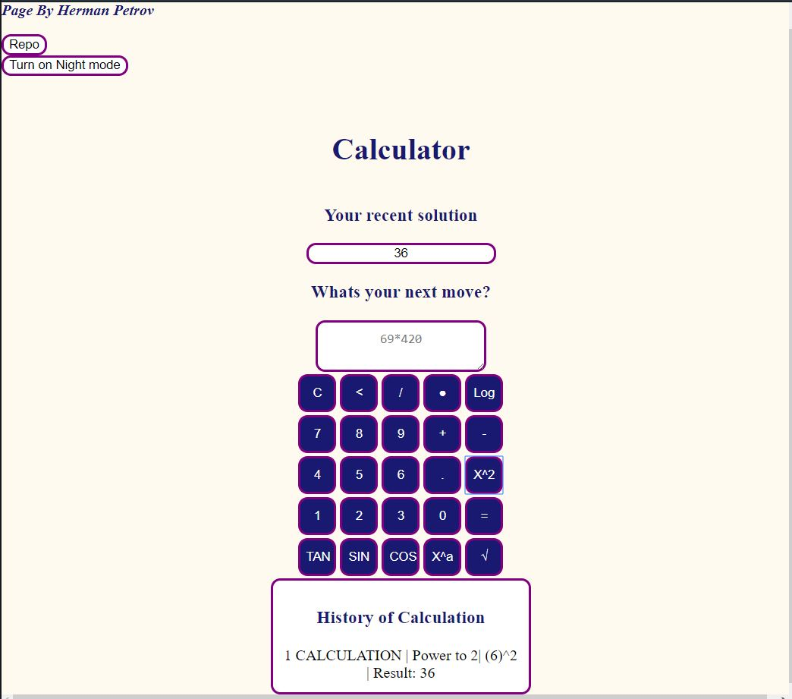
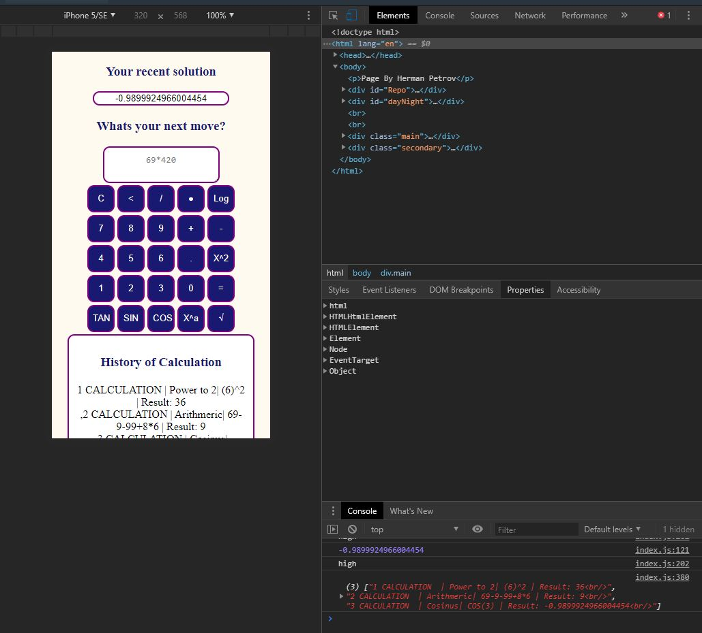

KODUTÖÖ  HERMAN PETROV

Olen loonud kella võttes esmalt õppe videost: https://www.youtube.com/watch?v=JDiurjhpOXA.
Videos õppinud: kuidas luua baas mis nuppe ja kuidas paigutada ja saata inputi vastuse lahtrisse.
Video õppe kalkulaatoris oli tava aritmeetika, jagamine, korrutamin ja punkti lisamine arvudele(komakoht).

Iseseisvalt olen kirjutan koodi ja võtsin vaid aluseks numbrite paigutust ja esmase funktsiooni, et onclick nuppud lööksid andmed sisse.
Iseseisvalt olen loonud paljud tingimused funktsioonidele, funktsioonid ja css kujunduse.

1.Lisatud kalkulaatorile minu poolt.
Öö- ja päevarežiim kujundus funktsioon - muudab lehe värvid vastavalt endale tahtele kas heledaks või tumedamaks.

2.Lisatud matemaatilised funktsioonid:
 1) ruutjuur
 2) astme lisamine
 3) ruudus arvutamine
 4) Cos arvutamine
 5) Sin Arvutamine
 6) Tan Arvutamine
 7)Logaritm Arvutamine.

3.Lisatud ajalugu vaade (toimib hetkel toimivas kasutaja sessioonis array abil) (1. mitmes tehe, mis arvutamis viis, arvutus käik, vastus).

4.Lisatud võimalus lisada eelnev vastus vajutades "hiljuti lisatud" nupu peale mille value uuendub iga arvutusega mida kasutaja sooritab.

5.Lisatud REPO link githubi.

6.Lisatud enda nimi kodutööle.

LINK loodud lehele :http://www.tlu.ee/~hp355837/Kodutoo_3/ 
DETAILSEM SELGITUS:

Lehel on vasakus nurgas lisatud kasutaja + repo nupp mis viip repositooriumile ning "Turn on Night/Day mode" mis on öö või päeva värvidega vahetus funktsioon. 

Kasutaja ees on olemas pealkiri "Calculator", "Your recent solution" tähendb kasutaja poolt hiljuti lahendatud tulemust. Mille peale vajutades saab ka lisada oma viimase tulemuse all oleva lahtrisse.
Alumine lahter on "Whats your next move?" ehk kuhu kasutaja sisetab enda andmed.

Kalkulaator töötab vaid nuppudu vajutustega ehk muudpidi ei saa sisestada teksti.
Nuppude all asub lahter ajaloost mis näitab kasutaja viimased arvutused. 

Funktsionaalsuse poole pealt leht toimib hästi mobiil lehena ka. Lehe funktsionaalsuse nuppud Tan Sin Cos x ruudus, , ruutjuur ja logaritm toimivad koheselt ehk kasutaja sisestatud andmed on kohe arvuatud. ülejäänud nuppud toimuvad tava sisestusega kuni kasutaja vajutab "=" võrdus märki. 

Üldiselt oli huvitav kodunetöö ning pigem raskusi oli määrata ära funktsioonid nii et ei oleks vigu ja arvutus käigud toimiksid. 

////////////////////////////////////////////////////////////////////////////////////////////////////////////////////////////////////////////////////////////////////////////////////////////////////////////////////////////////////////////////////////////////////////////////
# 3kodutoo - 15 punkti
3. kodutöö Eesrakenduste arendamises.

## Tähtaeg 02.05.2020 23:59

Kujundada ja programmeerida iseseisvalt töötav kalkulaator. Võib vabalt kasutada aluseks mõnda youtube'ist leitavad õpetust: https://www.youtube.com/results?search_query=javascript+calculator+tutorial - tutorial tuleb README failis ära märkida ning tulemus peab erinema õpetusest disain osas ja mõtlema juurde ise funktsionaalsuseid (tangensid, koosiinused, siinused, astmed, ruutjuured, logaritmid, exponentsiaalid, kahendsüsteem, mällu salvestamine jne).

## Nõuded

1. Veebirakendus töötab.
1. Kalkulaatoril on öö- ja päevarežiim. 
1. Kui kasutatud on mõnda õpetust, siis see on README-s ära märgitud ning lisatud sinna ise vähemalt 3 kalkuleerimisfunktsionaalsust
1. Lisatud on ajaloo funktsionaalsus - näidatakse varasemalt tehtud arvutusi (sama sessiooni jooksul). 
1. Autori ees- ja perenimi on lehel välja toodud
1. Lehel on viide rakenduse repositooriumile
1. `README.md` failis on välja toodud autori nimi, ekraanipilt rakendusest ja kirjeldatud funktsionaalsus
