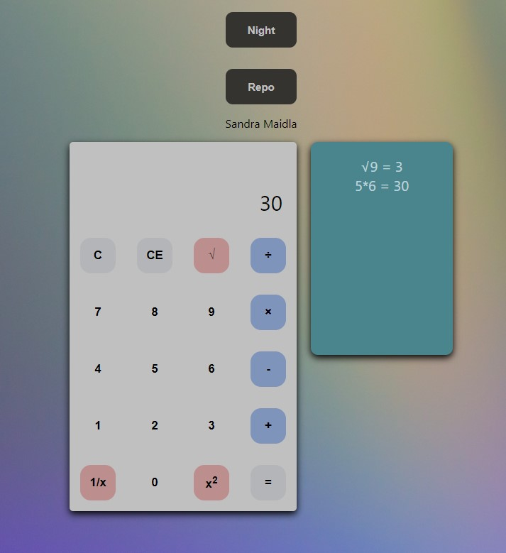

Funktsionaalsus: Kalkulaatoril on liitmine, lahutamine, korrutamine, jagamine, ruutu võtmine, ruutjuure võtmine ning 1'he jagamine arvuga.
Samuti näitab ta tehteid mis on sessiooni jooksul tehtud ning on olemas nupp repositooriumile ja öö/päev versioonile.

Õpetuseks kasutasin: https://www.youtube.com/watch?v=CI2GwL--ll8

Autor: Sandra Maidla
