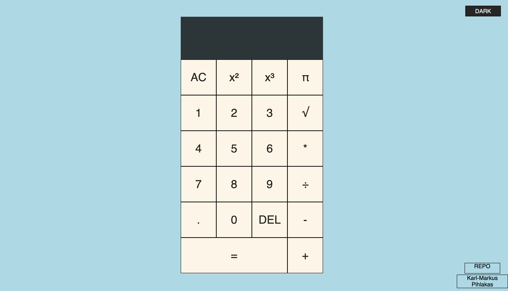

Henri Mägi, Kodutöö-3

Kalkulaatori tegemisel lähtuti "Web Dev Simplified" juhendist - https://www.youtube.com/watch?v=j59qQ7YWLxw

Juurde lisatud kalkuleerimisfunktsioonid:
- siinus
- koosinus
- tangens
- ruut
- ruutjuur

Võimalik on vahetada öö- ja päeva režiimi vahel.
Lisatud link repositooriumi juurde.

